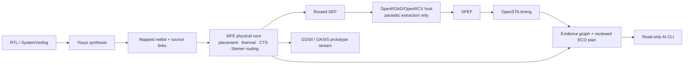

# Metric Field Engine — Developer Preview v0.1

MFE is an evidence-first RTL-to-layout research flow.  Its custom physical core owns floorplanning, placement, thermal analysis, CTS orchestration, and detailed-route topology.  Yosys, OpenROAD/OpenRCX, OpenSTA, and KLayout are adapters around that core—not replacements for it.

**Status:** developer preview. It is useful for reproducible experiments and AI-assisted diagnosis. It is not foundry-qualified, signoff-ready, or suitable for tapeout.

## What works today

- RTL synthesis through Yosys into a mapped netlist.
- MFE placement and pin-aware, same-layer rectilinear Steiner routing.
- DEF output, OpenRCX parasitic extraction, and real OpenSTA timing reports.
- Evidence graphs linking instances, nets, routes, timing paths, findings, and reviewed ECO proposals.
- Read-only AI CLI supporting offline evidence answers or an OpenAI-compatible local/remote endpoint.
- C++20 core plus 17 CTest checks.

## Architecture: what makes NexusSilicon different

NexusSilicon is not an OpenROAD wrapper. MFE owns the physical-design decisions; external projects are used through explicit file contracts only where they provide a mature specialized capability.



### MFE physical core

MFE provides the project-specific innovation:

- **Metric-field / optimal-transport placement** for geometry-aware movement of cells.
- **Thermal co-design** so temperature evidence is available alongside placement evidence.
- **DME clock-tree infrastructure** and a deterministic physical flow contract.
- **LEF-pin-aware routing** on the exact pin-access layer.
- **Rectilinear Steiner topology** for multi-pin nets: a median trunk and merged branches avoid the serial-chain routes and redundant loops typical of a simple demo router.
- **Evidence graph** links RTL symbols, mapped cells, placed instances, nets, routes, timing findings, and ECO proposals. The model queries this database; it does not need to guess by reading raw logs.

### External adapters

| Adapter | Role in NexusSilicon | Not used for |
|---|---|---|
| Yosys | RTL synthesis and standard-cell mapping | MFE placement/routing |
| Verible | SystemVerilog AST/lint integration target | physical implementation |
| OpenROAD/OpenRCX | OpenDB host and RC extraction | placement, CTS, routing |
| OpenSTA | path timing from Liberty, SDC, and SPEF | physical optimization decisions |
| KLayout / Magic | verification adapter boundary | MFE core algorithms |

## Flow stages and artifacts

1. **Frontend** — Verible/Yosys analyze RTL and create `mapped_netlist.v`.
2. **Physical compilation** — MFE imports the netlist and PDK LEF, floorplans, places, legalizes, evaluates thermal state, creates route topology, and writes `routed.def`.
3. **Extraction** — OpenRCX reads the MFE DEF through OpenDB and emits `design.spef`.
4. **Timing** — OpenSTA runs with Liberty, SDC, mapped netlist, and SPEF to produce `timing.rpt`.
5. **Reasoning** — MFE converts violations into `timing-evidence.json` and produces a review-only `eco-plan.json`.
6. **Verification boundary** — KLayout/Magic adapters receive stream/physical artifacts. Their results are never represented as signoff unless the relevant deck and complete layout requirements are genuinely met.

Typical generated artifacts:

```text
projects/gcd_demo/results/
├── frontend/mapped_netlist.v
├── physical/routed.def
├── physical/design.spef
├── physical/evidence-graph.json
├── timing/timing.rpt
├── timing/timing-evidence.json
└── timing/eco-plan.json
```

## Quick start: core and offline AI

Prerequisites: CMake 3.20+, a C++20 compiler, Eigen3, Python 3.10+.

```powershell
git clone <your-repository-url> mfe
cd mfe
cmake -S . -B build
cmake --build build --parallel
ctest --test-dir build --output-on-failure

# Query existing evidence without sending data to a model.
.\tools\mfe.ps1 ask -Project .\projects\gcd_demo\project.yaml `
  -Question "Why did timing fail?" -Offline
```

## AI CLI

The assistant is deliberately read-only. It can explain evidence and recommend an experiment; it cannot alter RTL, constraints, placement, routing, or ECO files.

```powershell
# Offline deterministic evidence answer
.\tools\mfe.ps1 ask -Project .\projects\gcd_demo\project.yaml `
  -Question "What is the critical timing path?" -Offline

# Any OpenAI-compatible endpoint, including a local model server.
$env:MFE_LLM_BASE_URL = "http://localhost:11434/v1"
$env:MFE_LLM_MODEL = "your-local-model"
# Optional only when the provider requires it:
$env:MFE_LLM_API_KEY = "..."
.\tools\mfe.ps1 ask -Project .\projects\gcd_demo\project.yaml `
  -Question "What is a safe next experiment?"
```

## Full Sky130 demonstration flow

The full flow requires separately installed open-source tools and Sky130 assets; they are intentionally not committed to this repository. Bootstrap source trees with:

```powershell
.\tools\bootstrap-third-party.ps1
```

Build/install the tools documented under `tools/`, then configure the required WSL OpenROAD path through `MFE_OPENROAD_WSL` when it differs from the default. Run:

```powershell
.\tools\mfe.ps1 flow -Project .\projects\gcd_demo\project.yaml
```

The generated files are under `projects/gcd_demo/results/`: mapped netlist, routed DEF, SPEF, timing report, ECO plan, and evidence graphs.

### PDK portability

PDK manifests use paths relative to the manifest itself. Adding a PDK means supplying a technology LEF, cell LEF, Liberty corner, routing-layer order, RC extraction rules, and verification deck references in `config/pdks/<pdk>/manifest.json`. The manifest is the portability boundary: MFE logic does not hard-code a particular node or foundry.

## Safety and current limits

- No automatic ECO application: every change must be reviewed, then re-placed, re-routed, re-extracted, re-timed, and validated.
- Mixed-layer PDK via insertion, DRC repair, real standard-cell-reference GDS/OASIS, and true LVS are future work.
- Public PDK data and each third-party tool retain their own licenses; see their upstream projects before redistribution.

## Repository layout

- `apps/`, `include/`, `src/` — MFE C++ core and CLI.
- `config/` — PDK manifests and JSON evidence contracts.
- `projects/gcd_demo/` — example RTL project.
- `tools/` — build adapters, flow entrypoint, and AI CLI.
- `tests/` — unit, integration, flow, and agent CLI tests.

```text
NexusSilicon/
├── apps/mfe/                 # C++ command-line application
├── include/mfe/              # public engine interfaces
├── src/                      # MFE implementation: placement, route, IO, evidence, ECO
├── config/pdks/              # PDK manifests and schemas
├── projects/gcd_demo/        # reproducible example project
├── tools/flow/               # RTL-to-physical orchestration
├── tools/adapters/           # Yosys, STA, RCX, DRC/LVS boundaries
├── tools/agent/              # evidence-first AI CLI
├── docs/                     # architecture and release status
└── tests/                    # CTest and AI CLI verification
```

## Roadmap

### v0.1 — Developer Preview (this release)

- Reproducible C++ core, manifests, test suite, CI, example project, and read-only AI evidence assistant.
- Real synthesis/extraction/timing adapter path where optional tools and PDK assets are installed.
- Explicit safety boundary: no fabricated timing, no automatic changes, no tapeout claim.

### v0.2 — Physical correctness

- Parse PDK via geometry and insert legal mixed-layer transitions.
- Track-grid and spacing-aware detailed routing with congestion feedback.
- Replace heuristic route topology with timing/congestion-weighted Steiner refinement.
- Ingest DRC results into findings and evidence graph; generate reviewed route-repair proposals.

### v0.3 — Closed-loop optimization

- PDK-legal candidate-cell selection for ECO sizing/buffering.
- Transactional ECO sandbox: edit → place → route → RCX → STA → validate → compare.
- Apply only changes that improve the target metric and preserve legality.
- Add power/IR and thermal constraints to multi-objective optimization.

### v0.4 — Layout and verification maturity

- Standard-cell-reference GDSII/OASIS assembly, correct layer/datatype map, pins, labels, and vias.
- Technology-complete DRC repair loop and true layout-versus-schematic flow.
- Regression benchmarks across multiple openly distributable PDKs.

### v1.0 — Collaboration platform

- Stable project and PDK plugin APIs.
- Rich local/web UI built on the same evidence graph.
- Reproducible run bundles, experiment comparison, permissions, and human approval workflows.

## Contributing

Run `ctest --test-dir build --output-on-failure` before opening a pull request. Do not commit build outputs, PDK installations, secrets, generated layout files, or model credentials.
