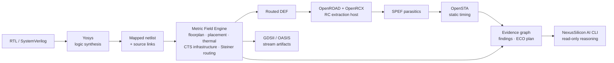

# NexusSilicon

> **A physics-native, evidence-first open-source chip-design flow.**

NexusSilicon is building a new kind of EDA platform: one where the physical-design engine is explainable by design, and where AI investigates structured engineering evidence instead of guessing from thousands of lines of tool logs.

At its heart is the **Metric Field Engine (MFE)**—a custom physical-design core for placement, thermal co-design, clock-tree infrastructure, and routing topology. Around MFE, NexusSilicon connects proven open-source tools for synthesis, parasitic extraction, timing analysis, and verification through open industry formats.

```text
Build chips with physics. Debug them with evidence.
```

## Why NexusSilicon?

Chip design is one of the most powerful engineering disciplines in the world, but modern RTL-to-layout flows remain difficult to inspect, difficult to automate, and difficult for new engineers to learn. A failure can begin in RTL, appear as timing loss after placement, and become buried under reports across multiple tools.

NexusSilicon is designed to make that chain visible.

- **Physical decisions are owned by MFE**, not hidden behind a black-box orchestration script.
- **Every important artifact becomes evidence**: RTL symbol → synthesized cell → placed instance → net → route → RC → timing path → finding.
- **AI starts from the evidence graph**, so it can answer *what failed, where, why, what is safe to try, and what will be affected*.
- **PDK configuration is manifest-driven**, creating a clean path to support multiple technology definitions without hard-coding one node into the engine.
- **Open formats stay central**: SystemVerilog, LEF, Liberty, DEF, SPEF, SDC, GDSII, and OASIS.

This is not another wrapper that simply calls an existing place-and-route tool. NexusSilicon uses external projects where they are mature specialists, while MFE remains the physical-intelligence core.

## The MFE core

The Metric Field Engine is the reason NexusSilicon exists. It is a custom C++20 engine built around geometry, fields, and structured physical evidence.

| MFE capability | Purpose |
|---|---|
| Metric-field / optimal-transport placement | Move cells using geometry-aware physical objectives. |
| Thermal co-design | Keep thermal state available alongside placement and routing evidence. |
| DME clock-tree infrastructure | Provide a deterministic foundation for clock skew balancing. |
| LEF-pin-aware routing | Route from real cell-pin access geometry rather than generic cell centers. |
| Rectilinear Steiner topology | Build compact multi-pin route trees instead of simple serial route chains. |
| Evidence graph | Trace design intent and physical consequences across every stage. |
| Reviewed ECO planning | Turn actual timing failures into explicit, safe-to-review experiments. |

The current Sky130 demonstration uses MFE routes, then validates the exported DEF through real OpenRCX extraction and OpenSTA timing analysis.

## Evidence-first AI

Most “AI for EDA” ideas give an LLM raw logs and hope for the best. NexusSilicon takes a different route.

The flow produces a compact JSON evidence graph. An agent can navigate deterministic relationships instead of rediscovering them from text:

```text
RTL symbol
  → synthesized standard cell
    → physical instance
      → net
        → route
          → extracted parasitics
            → timing path
              → finding
                → reviewed ECO proposal
```

The included AI CLI is intentionally **read-only**. It can explain results, expose the relevant path, and recommend a next experiment. It never silently edits RTL, constraints, placement, routing, or layout.

```powershell
# Deterministic local explanation: no model call, no data leaves your machine.
.\tools\mfe.ps1 ask -Project .\projects\gcd_demo\project.yaml `
  -Question "Why did timing fail?" -Offline
```

It can also use any OpenAI-compatible endpoint, including a local model server:

```powershell
$env:MFE_LLM_BASE_URL = "http://localhost:11434/v1"
$env:MFE_LLM_MODEL = "your-local-model"
.\tools\mfe.ps1 ask -Project .\projects\gcd_demo\project.yaml `
  -Question "What is the safest next timing experiment?"
```

## Architecture



### What each external tool does

NexusSilicon does not use OpenROAD for MFE’s placement or routing. The tool boundary is deliberate.

| Component | Role inside the flow |
|---|---|
| **Yosys** | Translates RTL into a standard-cell mapped netlist. |
| **Verible** | SystemVerilog parsing, linting, AST/LSP integration target. |
| **MFE** | Owns physical compilation: placement, thermal data, routing topology, physical evidence. |
| **OpenROAD/OpenRCX** | Hosts OpenDB and extracts RC parasitics from the MFE DEF. |
| **OpenSTA** | Calculates timing using Liberty, SDC, mapped netlist, and SPEF. |
| **KLayout / Magic** | Verification integration boundary. |

## What happens in a run

1. **Understand RTL** — parse/lint SystemVerilog and synthesize it to mapped gates.
2. **Create a physical database** — import LEF cell geometry, net connections, and source links into MFE.
3. **Compile the physical design** — floorplan, place, legalize, calculate thermal context, prepare CTS, and create pin-aware Steiner routes.
4. **Export interoperable artifacts** — write DEF, stream-layout artifacts, and MFE evidence.
5. **Extract reality from geometry** — OpenRCX converts routed shapes into resistance/capacitance parasitics in SPEF.
6. **Measure timing** — OpenSTA reports setup/hold paths and slack.
7. **Reason safely** — MFE produces timing findings and reviewed ECO proposals; the AI CLI makes the chain understandable.

```text
RTL → mapped netlist → MFE physical flow → DEF → RCX/SPEF → STA → evidence → AI explanation
```

## Quick start

### Build the portable core

Requirements:

- CMake 3.20 or newer
- C++20 compiler
- Eigen3
- Python 3.10 or newer (for the AI CLI test and assistant)

```powershell
git clone https://github.com/mkrishna793/NexusSilicon.git
cd NexusSilicon

cmake -S . -B build
cmake --build build --parallel
ctest --test-dir build --output-on-failure
```

The core test suite includes physical-flow, evidence-graph, manifest, timing-ECO, and AI-CLI tests.

### Ask the project about itself

```powershell
.\tools\mfe.ps1 ask -Project .\projects\gcd_demo\project.yaml `
  -Question "Show the current timing findings" -Offline
```

### Run the full Sky130 demonstration

The complete demonstration needs optional open-source tool sources and PDK assets. They are not committed into the repository; this keeps the project lightweight and respects each dependency’s license.

```powershell
# Fetch third-party source repositories declared in the toolchain manifest.
.\tools\bootstrap-third-party.ps1

# Build/install optional tools as described under tools/.
# Set this only when your WSL OpenROAD build is not at the documented default:
$env:MFE_OPENROAD_WSL = "/home/<user>/openroad/build/bin/openroad"

.\tools\mfe.ps1 flow -Project .\projects\gcd_demo\project.yaml
```

The output directory contains mapped RTL, routed DEF, SPEF, timing reports, evidence graphs, and reviewed ECO plans:

```text
projects/gcd_demo/results/
├── frontend/
│   └── mapped_netlist.v
├── physical/
│   ├── routed.def
│   ├── design.spef
│   └── evidence-graph.json
└── timing/
    ├── timing.rpt
    ├── timing-evidence.json
    └── eco-plan.json
```

## PDK-driven by design

A PDK is described by `config/pdks/<name>/manifest.json`. The manifest declares technology LEF, cell LEF, Liberty corners, routing layers, RC extraction rules, and verification references. Paths are resolved relative to the manifest, so projects can move between machines without embedding one developer’s directory structure.

This separation is important: MFE’s logic remains technology-neutral while the rules and assets of a PDK remain explicit, auditable configuration.

## Repository guide

```text
NexusSilicon/
├── apps/mfe/                 # MFE C++ command-line application
├── include/mfe/              # engine interfaces
├── src/                      # placement, routing, IO, evidence, ECO implementation
├── config/                   # schemas and PDK manifests
├── projects/gcd_demo/        # runnable SystemVerilog example
├── benchmarks/               # open benchmark fixtures
├── tools/flow/               # flow orchestrator
├── tools/adapters/           # external-tool contracts
├── tools/agent/              # evidence-first AI assistant
├── docs/                     # architecture and release documents
├── tests/                    # unit, integration, flow, and agent tests
└── third_party/toolchain.json# declared optional upstream dependencies
```

## Roadmap

### v0.1 — Developer Preview

The current release establishes the stable foundations: MFE core, portable manifests, evidence contracts, a read-only AI interface, reproducible tests, CI, and an open RTL-to-timing demonstration.

### v0.2 — Physical correctness and route quality

- PDK-derived legal via insertion for mixed-layer nets.
- Track-grid, spacing-aware detailed routing and congestion feedback.
- Timing/congestion-weighted Steiner refinement.
- DRC finding ingestion and reviewed route-repair proposals.

### v0.3 — Closed-loop physical optimization

- PDK-legal gate resizing and buffer candidates.
- Transactional ECO sandbox: modify → place → route → extract → time → validate.
- Automatic comparison of metrics, with human approval before applying a winning change.
- Power, IR-drop, and thermal objectives combined with timing and routability.

### v0.4 — Layout and verification maturity

- Standard-cell-reference GDSII/OASIS assembly.
- Correct layer/datatype mapping, vias, pins, and labels.
- DRC-repair and real LVS integration with reproducible evidence.

### v1.0 — Open collaboration platform

- Stable plugin interfaces for PDKs, tools, and AI providers.
- Local/web visualization built directly on the same evidence graph.
- Reproducible experiment bundles and team approval workflows.

## Current status

NexusSilicon is an open-source **developer preview**—a serious engineering foundation, not a tapeout claim. It already demonstrates MFE physical routing, real parasitic extraction, real timing analysis, structured evidence, and safe AI investigation. The remaining verification and signoff-grade capabilities are tracked openly in the roadmap rather than hidden behind marketing language.

## Contributing

Contributions are welcome. Start with a test, preserve the file-format contracts, and keep every physical or AI action explainable.

```powershell
ctest --test-dir build --output-on-failure
```

Please do not commit generated builds, PDK installations, tool binaries, secrets, or model credentials. See [NOTICE.md](NOTICE.md) for third-party dependency guidance and [LICENSE](LICENSE) for the project license.
